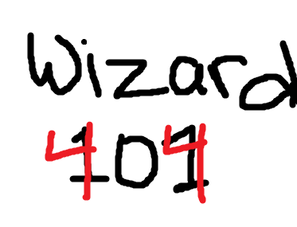

<!-- PROJECT LOGO -->
<br />
<p align="center">
  <a href="https://github.com/jkrutz/capstone-2021">
    
  </a>

  <h3 align="center">Capstone 2021</h3>

  <p align="center">
    A third-person fantasy combat game that positions players in the middle of a magic arena armed with nothing except a spell-casting wand. Team up and battle other mages. Become champion.
  </p>
</p>


<!-- TABLE OF CONTENTS -->
<details open="open">
  <summary><h2 style="display: inline-block">Table of Contents</h2></summary>
  <ol>
    <li>
      <a href="#about-the-project">About The Project</a>
      <ul>
        <li><a href="#built-with">Built With</a></li>
        <li><a href="#inspiration">Inspiration</a></li>
        <li><a href="#devs">The Developers</a></li>
      </ul>
    </li>
    <li>
      <a href="#core-concepts">Core Concepts</a>
      <ul>
        <li><a href="#graphics">Graphics</a></li>
        <li><a href="#multiplayer">Multiplayer</a></li>
        <li><a href="#ai">Artificial Intelligence</a></li>
      </ul>
    </li>
    <li><a href="#game">The Game</a>
      <ul>
        <li><a href="#player">The Player</a></li>
        <li><a href="#arena">The Arena</a></li>
        <li><a href="#spells">Spellcasting</a></li>
        <li><a href="#consumables">Consumables</a></li>
        <li><a href="#match">Match Mode</a></li>
        <li><a href="#sandbox">Sandbox Mode</a></li>
      </ul>
    </li>
    <li><a href="#extras">Extras</a></li>
    <li><a href="#roadmap">Roadmap</a></li>
    <li><a href="#process">Our Process</a></li>
  </ol>
</details>


<!-- ABOUT THE PROJECT -->
## About The Project

### Built With

* <a href="https://www.unrealengine.com/en-US/">Unreal Engine 4</a>
* <a href="https://www.blender.org/">Blender</a>
* Love

### Inspiration

The magic in this game is inspired by <a href="https://www.youtube.com/watch?v=02pr2W7FT-c">this scene</a> from Harry Potter and the Order of the Pheonix. In this battle, no spell is necessarily more powerful than the next, moves take a conscious effort and wit. We wanted to emulate this same kind of mechanic and throw it into an arena. In most conventional magic games, there seems to be a <a href="https://en.wikipedia.org/wiki/Rock_paper_scissors">rock-paper-scissors</a> relationship between casted spells; most often water beats fire, wind beats fire, etc. This greatly simplifies the thought process behind making moves and we believe this diminishes enjoyment. The complex and limitless interactions between two spells is what makes this game unique.


<!-- GETTING STARTED -->
## Getting Started

To get a local copy up and running follow these simple steps.

### Prerequisites

This is an example of how to list things you need to use the software and how to install them.
* npm
  ```sh
  npm install npm@latest -g
  ```

### Installation

1. Clone the repo
   ```sh
   git clone https://github.com/jkrutz/capstone-2021.git
   ```
2. Install NPM packages
   ```sh
   npm install
   ```


<!-- USAGE EXAMPLES -->
## Usage

Use this space to show useful examples of how a project can be used. Additional screenshots, code examples and demos work well in this space. You may also link to more resources.

_For more examples, please refer to the [Documentation](https://example.com)_


<!-- ROADMAP -->
## Roadmap

See the [open issues](https://github.com/jkrutz/capstone-2021/issues) for a list of proposed features (and known issues).


<!-- CONTRIBUTING -->
## Contributing

Contributions are what make the open source community such an amazing place to be learn, inspire, and create. Any contributions you make are **greatly appreciated**.

1. Fork the Project
2. Create your Feature Branch (`git checkout -b feature/AmazingFeature`)
3. Commit your Changes (`git commit -m 'Add some AmazingFeature'`)
4. Push to the Branch (`git push origin feature/AmazingFeature`)
5. Open a Pull Request


<!-- LICENSE -->
## License

Distributed under the MIT License. See `LICENSE` for more information.


<!-- CONTACT -->
## Contact

Your Name - [@twitter_handle](https://twitter.com/twitter_handle) - C22Joshua.Krutz@afacademy.af.edu

Project Link: [https://github.com/jkrutz/capstone-2021](https://github.com/jkrutz/capstone-2021)


<!-- ACKNOWLEDGEMENTS -->
## Acknowledgements

* []()
* []()
* []()


<!-- MARKDOWN LINKS & IMAGES -->
<!-- https://www.markdownguide.org/basic-syntax/#reference-style-links -->
[contributors-shield]: https://img.shields.io/github/contributors/jkrutz/repo.svg?style=for-the-badge
[contributors-url]: https://github.com/jkrutz/repo/graphs/contributors
[forks-shield]: https://img.shields.io/github/forks/jkrutz/repo.svg?style=for-the-badge
[forks-url]: https://github.com/jkrutz/repo/network/members
[stars-shield]: https://img.shields.io/github/stars/jkrutz/repo.svg?style=for-the-badge
[stars-url]: https://github.com/jkrutz/repo/stargazers
[issues-shield]: https://img.shields.io/github/issues/jkrutz/repo.svg?style=for-the-badge
[issues-url]: https://github.com/jkrutz/repo/issues
[license-shield]: https://img.shields.io/github/license/jkrutz/repo.svg?style=for-the-badge
[license-url]: https://github.com/jkrutz/repo/blob/master/LICENSE.txt
[linkedin-shield]: https://img.shields.io/badge/-LinkedIn-black.svg?style=for-the-badge&logo=linkedin&colorB=555
[linkedin-url]: https://linkedin.com/in/jkrutz
